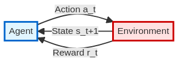
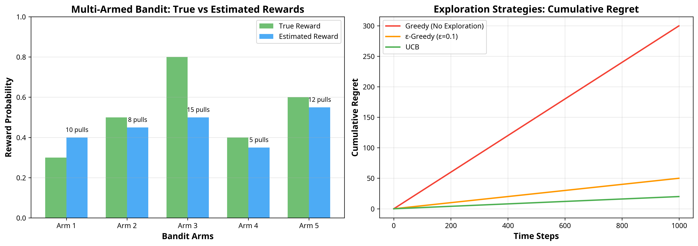
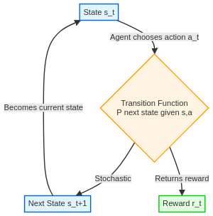
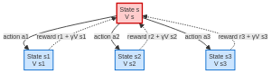
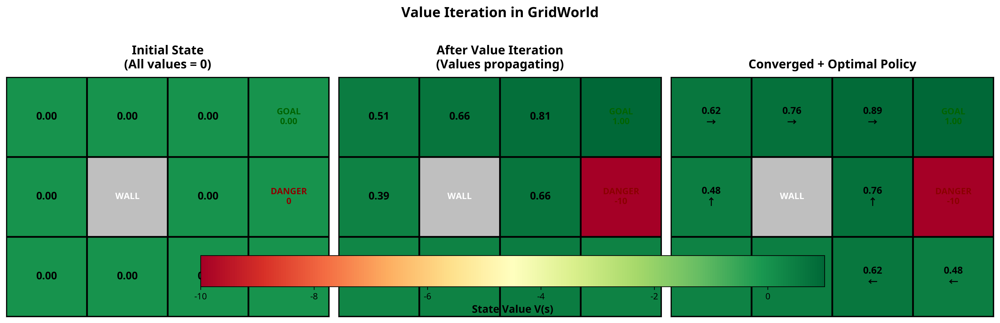

# Chapter 1: The Foundations of Reinforcement Learning

Welcome to the foundational chapter of our journey into Reinforcement Learning (RL). Before we dive into writing complex algorithms, it is crucial to build a strong intuition for the core concepts that underpin the field. Inspired by the practical, code-first approach of [fast.ai](https://www.fast.ai/), we will start with tangible examples and interactive code, building our understanding of the theory from the ground up.

## The Core Idea: Learning from Interaction

At its heart, Reinforcement Learning is about learning to make good decisions through trial and error. Imagine a baby learning to walk. It tries different movements (actions), sometimes it falls (negative reward), and sometimes it manages to take a step forward (positive reward). Over time, it learns to associate certain actions with positive outcomes and refines its strategy to walk more effectively. This is the essence of RL.

This interaction occurs in a feedback loop between two main components: the **agent** and the **environment**.

*   The **Agent** is the learner or decision-maker. It is the part of the system we are training, like the baby learning to walk or a computer program learning to play a game.
*   The **Environment** is the world the agent interacts with. It comprises everything outside the agent.

At each step, the agent observes the current state of the environment, takes an action, and receives a reward and the next state from the environment. This continuous cycle is known as the **agent-environment loop** [1].



*Figure 1: The agent-environment interaction loop. The agent takes an action, and the environment responds with a new state and a reward.* 

## The Multi-Armed Bandit: A First Taste of the Exploration-Exploitation Dilemma

Before we tackle the full complexity of sequential decision-making, let's consider a simpler problem: the **multi-armed bandit**. Imagine you are in a casino facing a row of slot machines (one-armed bandits). Each machine has a different, unknown probability of paying out a reward. Your goal is to maximize your total winnings over a series of pulls.

This scenario introduces a fundamental challenge in RL: the **exploration-exploitation tradeoff** [2].

*   **Exploitation**: You could stick with the machine that has given you the best rewards so far. This is a safe bet, but you might be missing out on an even better machine.
*   **Exploration**: You could try a machine you haven't played much. This is risky, as it might have a low payout, but it's the only way to discover the truly best machine.

Finding the right balance is key. A common strategy is the **ε-greedy (epsilon-greedy)** approach, where with a small probability ε, you explore a random machine, and with probability 1-ε, you exploit the one you currently believe is best.



*Figure 2: (Left) The agent's estimated rewards for each bandit arm compared to the true, unknown rewards. (Right) A comparison of cumulative regret for different exploration strategies. More effective exploration (like UCB) leads to lower regret over time.* 

## Formalizing the Problem: Markov Decision Processes (MDPs)

To move beyond single-step problems like the multi-armed bandit, we need a mathematical framework for sequential decision-making under uncertainty. This is the **Markov Decision Process (MDP)** [3]. An MDP is defined by five key components:

1.  **States (S)**: A set of all possible situations the agent can be in. For example, the position of a robot in a maze.
2.  **Actions (A)**: A set of all possible choices the agent can make.
3.  **Transition Model (T or P)**: The rules of the environment. It defines the probability of transitioning to a new state `s'` after taking an action `a` in state `s`. This is written as `P(s' | s, a)`.
4.  **Reward Function (R)**: A function that defines the reward the agent receives for transitioning from state `s` to `s'` after taking action `a`.
5.  **Discount Factor (γ)**: A value between 0 and 1 that determines the importance of future rewards. A discount factor of 0 makes the agent 
myopic (only caring about immediate rewards), while a value closer to 1 makes it more farsighted.



*Figure 3: The components of a Markov Decision Process. From a given state, the agent's action leads to a stochastic transition to a new state and a corresponding reward.*

### The Markov Property

A key assumption in MDPs is the **Markov Property**, which states that **the future is independent of the past given the present** [3]. In other words, the current state `s_t` provides all the necessary information to make a decision. We don't need to know the entire history of states and actions that led to the current state.

> **The Markov Property**
> A state `s_t` is Markov if and only if:
> P(s_{t+1} | s_t) = P(s_{t+1} | s_1, s_2, ..., s_t)

This simplifies the problem immensely, as the agent can make optimal decisions based solely on its current observation.

## Policies and Value Functions: Evaluating "Goodness"

How does an agent decide which action to take? This is determined by its **policy (π)**, which is a mapping from states to actions. A policy can be:

*   **Deterministic**: For a given state, the policy always returns the same action.
*   **Stochastic**: For a given state, the policy returns a probability distribution over actions.

But how do we know if a policy is good? We need a way to quantify the expected long-term reward. This is where **value functions** come in. There are two main types:

1.  **State-Value Function (V(s))**: The expected return when starting in state `s` and following policy `π` thereafter.
2.  **Action-Value Function (Q(s, a))**: The expected return when starting in state `s`, taking action `a`, and then following policy `π`.

## The Bellman Equation: A Recursive Relationship

The **Bellman Equation** is a cornerstone of RL. It provides a recursive relationship that connects the value of a state to the values of its successor states [4]. It expresses the idea that the value of your current state is the immediate reward plus the discounted value of the state you end up in.



*Figure 4: A Bellman backup diagram. The value of the current state (red) is determined by the expected values of the possible next states (blue), weighted by the probabilities of transitioning to them.*

For a given policy `π`, the Bellman equation for the state-value function is:

`V^π(s) = E[R_{t+1} + γV^π(S_{t+1}) | S_t = s]`

This equation forms the basis for many RL algorithms. It allows us to iteratively compute the value function for a given policy.

## Finding the Optimal Solution

The ultimate goal of RL is to find the **optimal policy (π*)**, which is the policy that achieves the highest possible expected return from all states. The optimal policy has an associated optimal state-value function `V*(s)` and optimal action-value function `Q*(s, a)`.

Two classic dynamic programming algorithms for finding the optimal policy in an MDP (when the model is known) are **Value Iteration** and **Policy Iteration** [4].

*   **Value Iteration**: This algorithm starts with an arbitrary value function and iteratively applies the Bellman Optimality Equation to converge to the optimal value function. The policy is then extracted by choosing the action that maximizes the expected value.
*   **Policy Iteration**: This algorithm alternates between two steps: **policy evaluation** (calculating the value function for the current policy) and **policy improvement** (greedily improving the policy based on the current value function).



*Figure 5: Visualization of Value Iteration in a simple GridWorld. The values of the states are iteratively updated until they converge, at which point the optimal policy (arrows) can be extracted.*

## Putting it into Practice with Code: Gymnasium

Now, let's ground these concepts in code. The standard toolkit for creating and interacting with RL environments is **Gymnasium** (the successor to OpenAI's Gym) [5]. It provides a simple, Pythonic interface for a wide variety of environments.

Here is the basic structure of a Gymnasium interaction loop:

```python
import gymnasium as gym

# 1. Create the environment
env = gym.make("LunarLander-v2", render_mode="human")

# 2. Reset the environment to get the initial observation
observation, info = env.reset()

# 3. Loop through a number of steps
for _ in range(1000):
    # 4. Choose an action (here, a random one)
    action = env.action_space.sample()

    # 5. Take the action and get the next state, reward, and other info
    observation, reward, terminated, truncated, info = env.step(action)

    # 6. If the episode is over, reset the environment
    if terminated or truncated:
        observation, info = env.reset()

# 7. Close the environment
env.close()
```

This simple script demonstrates the core agent-environment loop. In the chapters that follow, we will replace the random action selection with sophisticated learning algorithms to create intelligent agents.

## References

[1] Sutton, R. S., & Barto, A. G. (2018). *Reinforcement Learning: An Introduction*. MIT Press. [http://incompleteideas.net/book/the-book-2nd.html](http://incompleteideas.net/book/the-book-2nd.html)

[2] Analytics Vidhya. (2018). *Multi Armed Bandit Problem & Its Implementation in Python*. [https://www.analyticsvidhya.com/blog/2018/09/reinforcement-multi-armed-bandit-scratch-python/](https://www.analyticsvidhya.com/blog/2018/09/reinforcement-multi-armed-bandit-scratch-python/)

[3] GeeksforGeeks. (2025). *Markov Decision Process*. [https://www.geeksforgeeks.org/machine-learning/markov-decision-process/](https://www.geeksforgeeks.org/machine-learning/markov-decision-process/)

[4] Karpathy, A. (n.d.). *REINFORCEjs: Gridworld with Dynamic Programming*. [https://cs.stanford.edu/people/karpathy/reinforcejs/gridworld_dp.html](https://cs.stanford.edu/people/karpathy/reinforcejs/gridworld_dp.html)

[5] Farama Foundation. (2023). *Gymnasium Documentation*. [https://gymnasium.farama.org/](https://gymnasium.farama.org/)
